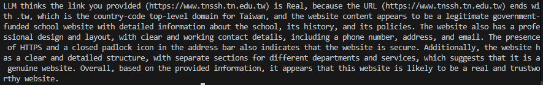

# badsitesLM
Use LLM to find if the site is bad.  
## Demo  
A Minecraft server software website:  
  
A Taiwanese high school website:  
  
A fake website:  
  
## Usage
1. Install requirements. `pip install -r requirements.txt`
2. Rename `example.env` to `.env` then fill the value
2. Run `python main.py`
3. Paste your URL 
4. Wait for LLM to response!